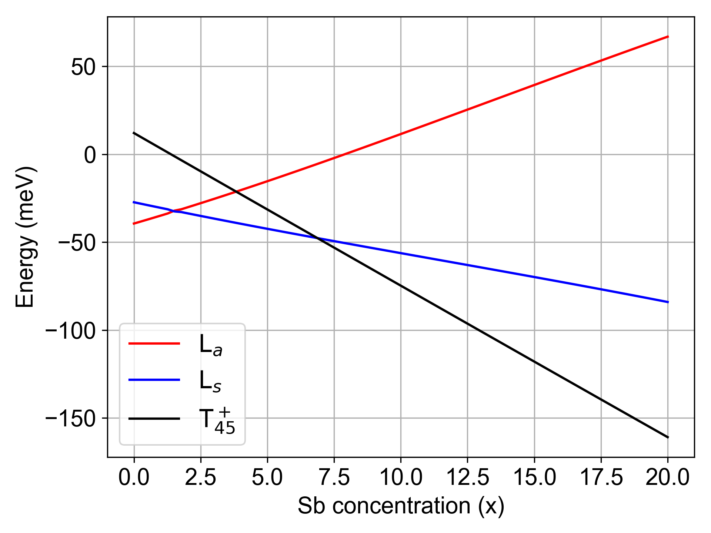
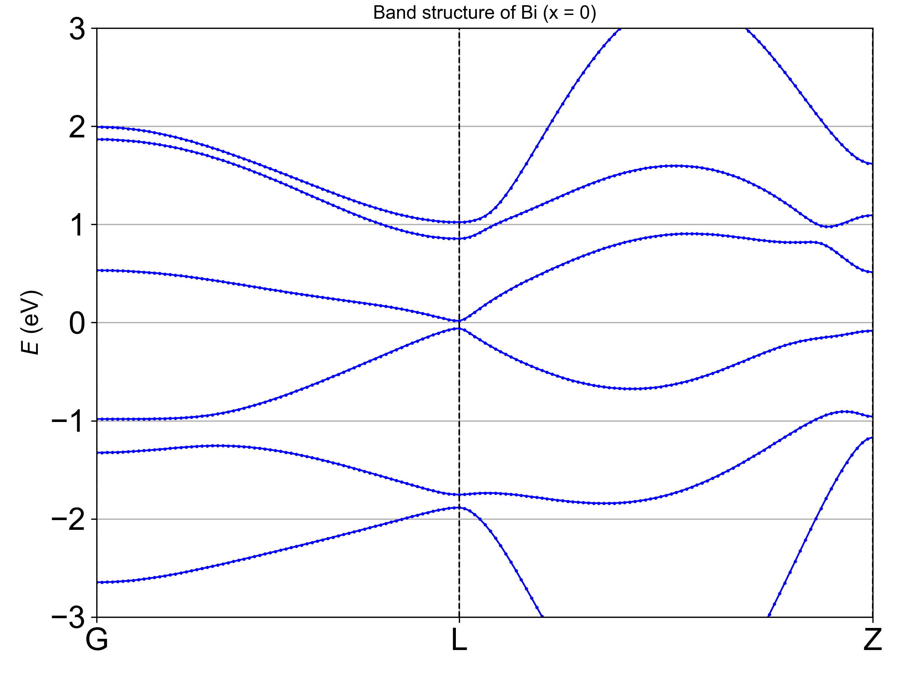

# Tight-Binding Model with virtual crystal approximation for Bi-Sb alloy

This repository contains a Python script for calculating the tight-binding (TB) model for bismuth (Bi) and antimony (Sb). The script computes eigenvalues and eigenvectors of the TB Hamiltonian, simulates the evolution of the bands with varying Sb concentration, and plots both the concentration-dependent band evolution and the full band structure for Bi.

## Overview

The main objectives of this code are to:
- Calculate the TB model parameters for Bi and Sb based on a reference (Electronic structure of the semimetals Bi and Sb, *Physical Review B* 1995).
- Perform a single calculation of the TB model for given parameters.
- Compute and plot the evolution of the energy bands over a range of Sb concentrations.
- Generate the band structure of Bi using crystallographic information from a CIF file.

## Files in the Repository

- **main script (e.g., `tb_model.py`)**  
  Contains the main routines including:
  - Parameter definition for Bi and Sb.
  - Calculation routines that mix the parameters using a virtual crystal approximation (`vca_params`).
  - Solving the TB Hamiltonian (`solve_H`).
  - Plotting routines for concentration-dependent band evolution and full band structure.
- **utils.py**  
  This module is imported in the main script and is expected to include auxiliary functions such as `vca_params` and `solve_H`.
- **Bi.cif**  
  A CIF file containing crystallographic data for bismuth, used for the band structure calculation.
- **Output Files**  
  - `line.pdf`: Plot of the band evolution with Sb concentration.
  
  - `band_structure_all.png`: Band structure plot for x=0.11.
  

## Requirements

The code requires the following Python packages:
- [NumPy](https://numpy.org/)
- [Matplotlib](https://matplotlib.org/)
- [ASE (Atomic Simulation Environment)](https://wiki.fysik.dtu.dk/ase/)
- Any additional custom modules (such as `utils.py`) should be present in the repository.

You can install the required packages using pip:

```bash
pip install numpy matplotlib ase
